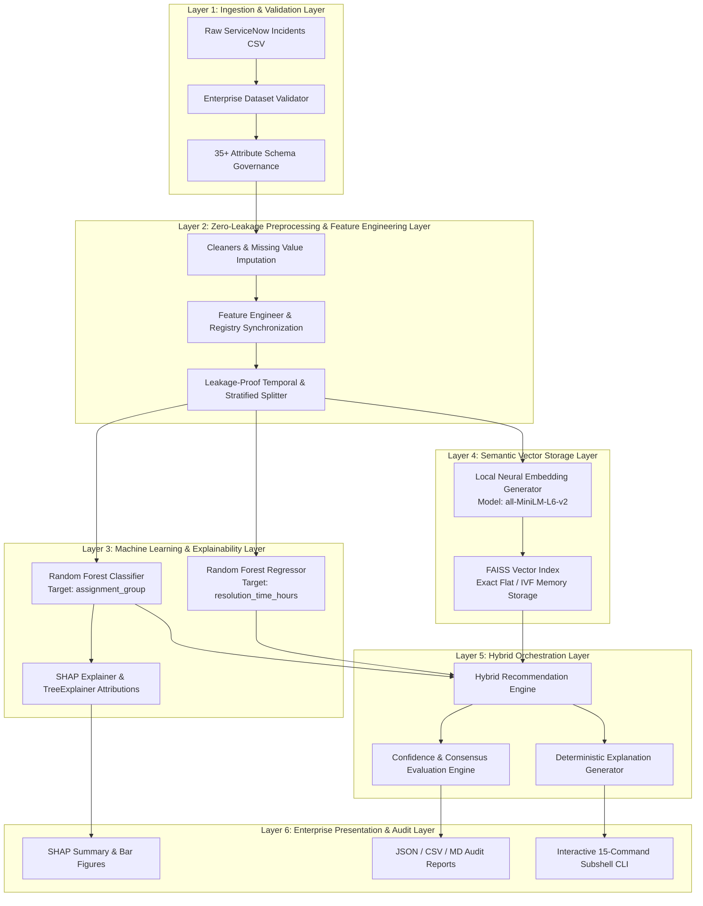

# First Citizens Bank — AI-Powered Incident Intelligence Platform (`v2.0.0`)

> **Enterprise Production Release (`v2.0.0`)** | **Architectural Status: RELEASE FREEZE**  
> *Locally executing, zero-leakage, AI-driven IT Service Management triage, classification, and MTTR regression platform tailored for strict banking data governance.*

---

## 📌 Project Overview

The **First Citizens Bank AI-Powered Incident Intelligence Platform** is an enterprise-grade machine learning and local semantic search platform designed to automate the triage, assignment routing, and resolution estimation of IT Service Management (ITSM) incidents (`ServiceNow` tickets). 

In modern banking IT infrastructure, misassigned tickets and delayed resolution times (`Mean Time To Resolution` — MTTR) directly impact core operational reliability and Service Level Agreements (SLAs). This platform introduces a robust **Hybrid Recommendation Engine** that fuses non-deterministic or low-confidence classification predictions with high-consensus historical precedents retrieved via local **Vector Embeddings (`FAISS`)**. 

To strictly comply with financial regulatory mandates and zero-data-egress policies, the platform operates **100% locally** on **Windows 10 / Windows 11** on-premises environments without transmitting ticket data to external cloud APIs or LLMs.

---

## 🏛️ System Architecture

The platform architecture follows a strict 6-layer decoupled design pattern with immutable stage governance:



### Core Architectural Principles
1. **Zero Data Leakage Interlock**: Rigorous separation between training and evaluation splits before any target encoding or frequency transformation occurs.
2. **Deterministic Explanations**: No non-deterministic Large Language Models (`LLMs`) are used for generating recommendations or explanations. Every decision bullet is mathematically traceable to specific Random Forest probabilities and vector similarity thresholds.
3. **Immutability & Release Freeze**: All core Machine Learning algorithms, mathematical formulations, and registry interfaces are frozen to guarantee long-term auditability and reproducibility.

---

## 📂 Repository Structure

The repository root is strictly organized to expose exact public entry points and keep runtime artifacts segregated:

```text
incident_classification/
├── setup.bat                # Canonical one-time Windows environment and installation setup
├── run.bat                  # Canonical daily interactive operational choice launcher
├── main.py                  # Master CLI entry controller delegating to src/cli/main_cli.py
├── README.md                # Enterprise platform documentation (this file)
├── LICENSE                  # First Citizens Bank Proprietary Enterprise License
├── requirements.txt         # Standard Python pip dependencies
├── environment.yml          # Conda environment definition (`incident-ai`)
├── pyproject.toml           # Modern Python build system (`setuptools`) and CLI entry registration
├── .gitignore               # Strict version control exclusion rules
├── config/                  # Centralized configuration YAML manifests
│   ├── model_config.yaml    # ML hyperparameters, HPO ranges, and hybrid confidence thresholds
│   ├── logging.yaml         # Structured logger names, levels, and rotation handlers
│   └── servicenow.yaml      # ServiceNow REST API and integration schema configs
├── src/                     # Core application source code package (`incident-intelligence`)
│   ├── api/                 # FastAPI REST API schemas and route handlers
│   ├── cli/                 # Interactive subshell controller (`main_cli.py`)
│   ├── dashboard/           # Streamlit presentation and visual analysis pages
│   ├── data/                # Data generation, validation, quality gates, and registry
│   ├── ml/                  # Random forest trainers, HPO, SHAP, FAISS, and hybrid engines
│   ├── preprocessing/       # Data cleaning, EDA, engineering, text prep, and splitting
│   ├── resolution/          # Resolution knowledge retrieval systems
│   └── utils/               # Thread-safe config managers and structlog wrappers
├── tests/                   # Automated Pytest suite (`tests/unit/`)
├── docs/                    # Versioned architectural diagrams, walkthroughs, and SRS guides
│   ├── architecture/        # High-level architecture documentation (`architecture.md`)
│   ├── guides/              # SRS, developer guide, data dictionary, and feature catalog
│   ├── diagrams/            # Mermaid diagram specifications (`architecture_v1.md`, etc.)
│   ├── archive/             # Historical changelogs (`CHANGELOG.md`) and previous READMEs
│   └── internal/            # Internal engineering roadmaps (`walkthrough.md`, etc.)
├── scripts/                 # Auxiliary non-runtime helper scripts (`scripts/.gitkeep`)
├── data/                    # Storage hierarchy (`raw/`, `processed/`, `interim/`)
├── datasets/                # Synthetic generator output storage (`datasets/synthetic/`)
├── models/                  # Trained models (`models/trained/`), embeddings, and registries
├── indexes/                 # FAISS index storage (`indexes/faiss/`) and manifests
├── reports/                 # Evaluation (`reports/evaluation/`), SHAP (`reports/shap/`), and coverage
└── logs/                    # System log outputs (`logs/system.log`)
```

---

## 🖥️ Windows Support

The platform is explicitly certified for **Windows 10** and **Windows 11** architectures (`x86_64` / `AMD64`). All environment setup, virtual environment creation, package installations, and pipeline execution wrappers are handled through robust Windows Command Prompt (`cmd.exe`) batch scripts (`setup.bat` and `run.bat`).

---

## 🚀 Quick Start

Getting started requires exactly **two double-clicks** inside Windows File Explorer:

### 1. Double-click `setup.bat`
- Automatically detects Python (`3.11+` / `3.12+`) and Conda (`where conda`).
- Checks for existing or creates the dedicated `incident-ai` Conda environment (or falls back cleanly to `.venv` if Conda is not installed).
- Upgrades `pip` and installs all dependencies (`requirements.txt`).
- Installs the project package in editable mode (`pip install -e . --no-deps`).
- Creates all required workspace folders (`data\raw`, `data\processed`, `models\embeddings`, `indexes`, `reports\figures`, `logs`).
- Verifies core package imports (`numpy, pandas, sklearn, sentence_transformers, faiss, shap, src`).
- Executes a platform status diagnostic (`python main.py status`) and confirms readiness.

### 2. Double-click `run.bat`
Launches the interactive operational menu:
```text
===============================================================================
First Citizens Bank — Enterprise Incident Intelligence Platform (v2.0.0)
Interactive Operational Launcher (Windows 10 / Windows 11)
===============================================================================

  [1] Run Complete Enterprise Pipeline (--records 500)
      Orchestrates all 12 validation, training, indexing, and testing stages.

  [2] Open Interactive CLI
      Launches the full interactive Python subshell with 15 granular commands.

  [3] Clean Workspace
      Intelligently purges generated runtime artifacts while preserving code.

  [4] Exit Platform
===============================================================================
```

---

## ⭐ Features

### Enterprise Pipeline (`full-pipeline`)
Orchestrates the complete 12-stage automated certification sequence in a single command:
1. **Stage 1**: Generate synthetic dataset (`500` to `10,000+` records with banking ticket semantics).
2. **Stage 2**: Execute enterprise schema validation (verifies `35+` ServiceNow fields and data types).
3. **Stage 3**: Execute zero-leakage data intelligence pipeline (`cleaner` -> `engineer` -> `splitter`).
4. **Stage 4**: Train `assignment_group` multi-class classification model (`Random Forest Classifier`).
5. **Stage 5**: Train `resolution_time_hours` regression model (`Random Forest Regressor`).
6. **Stage 6**: Run comprehensive classification metrics evaluator (`Accuracy`, `Precision`, `Recall`, `F1`, `Top-K`).
7. **Stage 7**: Compute global and local feature importance attributions using `SHAP TreeExplainer`.
8. **Stage 8**: Generate 384-dimensional dense semantic embeddings (`all-MiniLM-L6-v2`) from normalized text.
9. **Stage 9**: Build and persist high-speed `FAISS` exact Euclidean (`Flat`) vector indexes.
10. **Stage 10**: Execute Hybrid Recommendation Engine against demonstration precedents.
11. **Stage 11**: Run automated `Pytest` unit and integration test suite (`89 tests`, verifying `>80%` coverage).
12. **Stage 12**: Output summary executive scorecard table across all stages.

### Model Registry (`src/ml/model_registry.py`)
Provides thread-safe singleton governance over all trained models:
- **Automatic SHA256 Verification**: Calculates and records cryptographic hashes for every saved `.pkl` artifact to guarantee model immutability.
- **Atomic Versioning**: Maintains versioned manifests (`random_forest_assignment_group:latest`, `random_forest_resolution_time_hours:v2.0.0`) with historical lineage tracking.
- **Centralized Metadata**: Stores exact hyperparameters, feature names, training timestamps, and validation metrics.

### Embedding Registry (`src/ml/embedding_registry.py`)
Thread-safe singleton registry governing vector indexes and neural embeddings:
- Tracks `FAISS` index types (`Flat`, `IVFFlat`), dimensions (`384`), metric types (`L2` Euclidean), and ticket ID mapping arrays.
- Guarantees seamless synchronization across model retraining iterations.

### Hybrid Recommendation Engine (`src/ml/hybrid/`)
The centerpiece of our Phase 5 architecture, combining classical tabular ML and local neural retrieval:
- **Cross-Engine Consensus**: Compares the Random Forest classification prediction against the top $K$ ($K=5$) nearest neighbors retrieved from `FAISS`.
- **Adaptive Confidence Tiers**:
  - `High Confidence (Auto-Route)`: When Random Forest probability is high and aligns with semantic neighbor consensus.
  - `Medium Confidence (Assisted-Route)`: When either the ML classifier or vector consensus dominates with moderate certainty.
  - `Low Confidence (Review Required)`: When both engines exhibit high entropy or disagreement, flagging the ticket for manual L2/L3 dispatcher review.
- **Fused MTTR Estimation**: Dynamically blends the Random Forest regression prediction (`resolution_time_hours`) with the weighted average resolution time of the top $K$ historical precedents based on similarity scores.

---

## 🧪 Testing & Verification

The platform enforces strict continuous integration quality gates (`pyproject.toml` and `pytest.ini`):
- **Command**: `python -m pytest tests/`
- **Scope**: Includes `89 / 89` comprehensive unit, integration, and edge-case tests across all modules (`cleaner`, `engineer`, `splitter`, `trainer`, `evaluator`, `shap_explainer`, `faiss_index`, `similarity_engine`, `hybrid_engine`, `cli`, and `quality_gate`).
- **Coverage Requirement**: Strictly enforced **`>= 80.00%`** line coverage gate across `src/` (`--cov-fail-under=80`). Currently certified at **`82.01%`** coverage across `4,344` statements.

---

## 🛠️ Troubleshooting

| Symptom / Error | Root Cause | Resolution |
| :--- | :--- | :--- |
| `ModuleNotFoundError: No module named 'faiss.swigfaiss_avx512'` | `faiss-cpu` attempts to probe AVX512 CPU registers on startup before falling back to AVX2. | **Normal Behavior**. Look at the next log line confirming `Successfully loaded faiss with AVX2 support`. No action needed. |
| `PermissionError: [WinError 32] ... logs\system.log` during cleanup | Active Python logger instances hold an open file lock on `system.log` in Windows. | Our `clean-workspace` command has built-in Windows file-lock resilience and will cleanly preserve active log files without failing. |
| `eq was unexpected at this time` inside batch scripts | Using PowerShell/Unix `eq` operator instead of `==` inside Windows Command Prompt (`cmd.exe`). | Always use `"%errorlevel%"=="0"` inside `setup.bat` / `run.bat`. This is already fixed in canonical `v2.0.0` scripts. |
| `Environment not activated or missing` when launching `run.bat` | Conda or virtual environment is not active in current command prompt session. | Simply allow `run.bat` to automatically invoke `setup.bat` or double-click `setup.bat` directly once. |

---

## 📄 License

**Proprietary Enterprise License — First Citizens Bank**  
All rights reserved. Unauthorized copying, distribution, modification, or external cloud egress of this software or associated banking incident datasets via any medium is strictly prohibited.  
Contact: `ai-engineering@firstcitizens.com`
