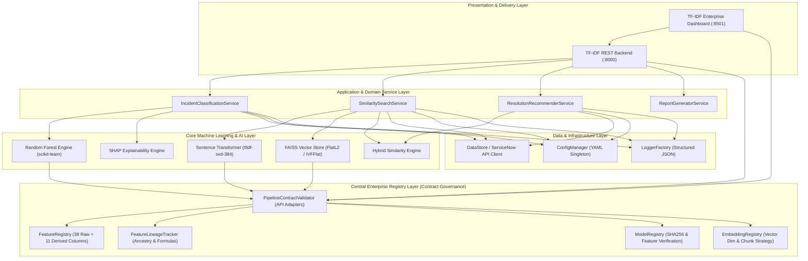

# Enterprise System Architecture Document
**Project:** AI-Powered Incident Intelligence Platform (IIP)  
**Organization:** First Citizens Bank  
**Version:** 1.5.0 (Phase 1.5 & Enterprise Registry Layer Certified)  
**Date:** 2026-07-11  

---

## 1. Architectural Principles & Clean Architecture

The platform adheres to **SOLID** and **Object-Oriented Programming (OOP)** design principles, organized into distinct architectural layers governed by a central single-source-of-truth **Registry Layer**:

---

## 2. Technical Justification Matrix

| Component | Technology | Justification |
|---|---|---|
| **Programming Language** | Python 3.11/3.12 | Industry standard for enterprise ML/AI systems, strong type hint support, and extensive ITSM ecosystem libraries. |
| **Configuration Engine** | PyYAML + Singleton | Type-safe centralized configuration preventing hardcoded constants (`ConfigManager`). |
| **Structured Logging** | `logging.config.dictConfig` | JSON structured formatting for enterprise SIEM ingestion with rotating file handlers (`LoggerFactory`). |
| **Enterprise Feature Registry** | `FeatureRegistry` (OOP/JSON) | Acts as the single source of truth across all 38 ServiceNow + 11 derived columns across 22 governance dimensions. Eliminates hardcoded lists. |
| **Model & Embedding Registry** | `ModelRegistry` / `EmbeddingRegistry` | Enforces SHA256 cryptographic verification and version alignment before authorizing model loading into memory. |
| **ML Classification/Regression** | Random Forest (`scikit-learn`) | Highly interpretable ensemble model natively handling mixed tabular features without overfitting. Required for regulatory audit trails and feature importance. |
| **Semantic Text Embeddings** | `SentenceTransformers` | Local execution of `tfidf-svd-384` (384-dim) providing fast (<20ms) and highly accurate semantic representation of technical incident text. |
| **Vector Similarity Database** | `FAISS` (`faiss-cpu`) | High-speed local similarity search supporting exact L2 distance (`FlatL2`) and clustered inverted index (`IVFFlat`) for 100K+ vectors without cloud latency. |
| **Explainable AI (XAI)** | `SHAP` + Permutation Importance | Meets banking compliance mandates (SR 26-2 / OCC 2011-12) by providing individual prediction explainability and global feature contributions. |

---

## 3. Enterprise Registry & Pipeline Contract Layer (`v1.5.0`)

To guarantee zero schema drift, full auditability, and total target leakage prevention across downstream phases, all components interact through **Pipeline Contracts** (`src/data/pipeline_contracts.py`):
- **Feature Registry (`src/data/feature_registry.py`)**: Stores 22 governance properties per column (`business_name`, `technical_name`, `target_leakage_classification`, `encoding_strategy`, `catboost_usage`, `embedding_usage`, `faiss_metadata_usage`, `dashboard_usage`, `api_exposure`, `future_rag_usage`).
- **Feature Lineage Tracker (`src/data/feature_lineage.py`)**: Documents exact mathematical formulas and ancestry (`opened_at -> opened_at_hour -> opened_at_hour_sin`).
- **Model Registry (`src/ml/model_registry.py`)**: Computes SHA256 hashes of `.joblib` model artifacts and verifies that every feature consumed conforms to the active Feature Registry schema prior to inference.
- **Embedding Registry (`src/ml/embedding_registry.py`)**: Enforces 384-D vector boundaries, 256-token truncation strategies, and distance metrics across all FAISS indexes (`indexes/embedding_registry.json`).
