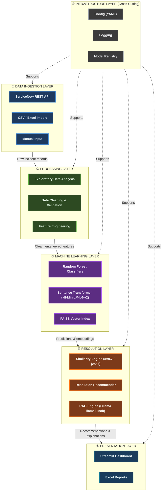
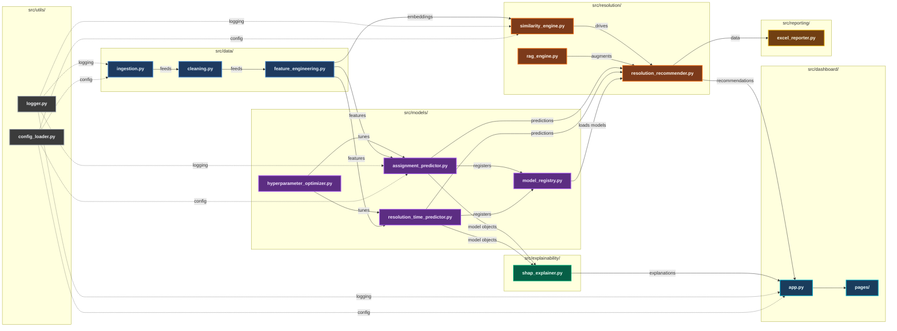
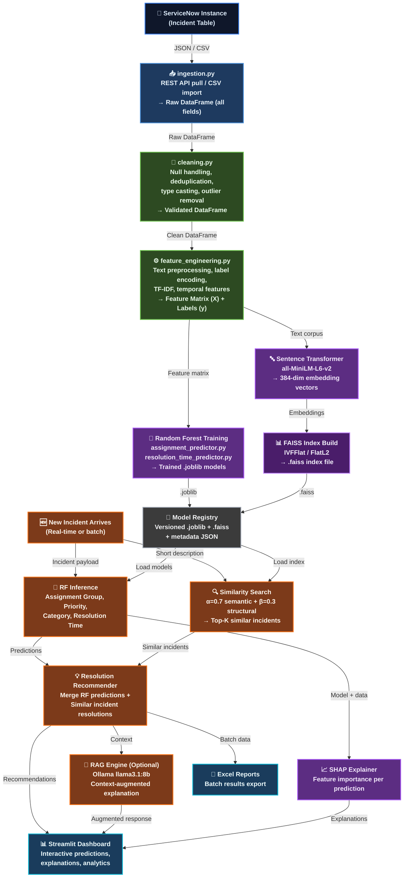
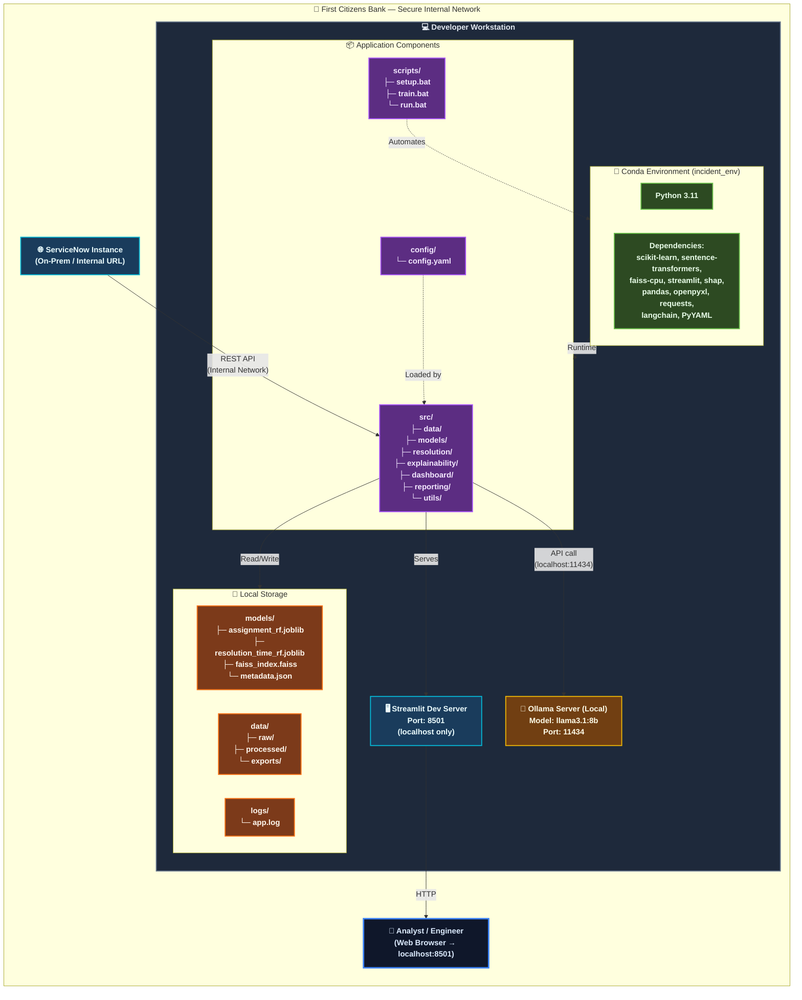

# AI-Powered Incident Intelligence Platform — Architecture Document

| Field                | Value                                        |
|----------------------|----------------------------------------------|
| **Version**          | 1.0                                          |
| **Date**             | 2026-07-10                                   |
| **Status**           | Under Review                                 |
| **Author**           | Principal Software Architect                 |
| **Organization**     | First Citizens Bank — IT Operations           |
| **Classification**   | Internal / Confidential                      |

---

## Table of Contents

1. [High-Level System Architecture](#1-high-level-system-architecture)
2. [Component Diagram](#2-component-diagram)
3. [Data Flow Diagram](#3-data-flow-diagram)
4. [Deployment Diagram](#4-deployment-diagram)

---

## 1. High-Level System Architecture

This diagram presents a top-down view of the platform's layered architecture. Data flows downward from ingestion through processing and machine learning into the resolution engine, and finally surfaces through the presentation layer. The infrastructure layer runs orthogonally, providing cross-cutting concerns (configuration, logging, model persistence) to every other layer.

---

## 2. Component Diagram

This diagram maps every source module (`src/` subdirectory and file) and illustrates the dependency graph between them. Arrows indicate "depends on" or "calls into" relationships. Understanding these dependencies is critical for build ordering, test isolation, and change-impact analysis.

---

## 3. Data Flow Diagram

This diagram traces the journey of a single incident record from its origin in ServiceNow through every transformation stage until it reaches the end-user on the Streamlit dashboard. Each node describes the data shape at that point in the pipeline.

---

## 4. Deployment Diagram

This diagram illustrates the on-premises deployment topology. The entire platform executes within the bank's secure internal network on a developer workstation. No data leaves the perimeter. A Conda virtual environment isolates all Python dependencies, and local storage houses models, data, logs, and configuration.

---

## Revision History

| Version | Date       | Author                        | Changes                          |
|---------|------------|-------------------------------|----------------------------------|
| 1.0     | 2026-07-10 | Principal Software Architect  | Initial architecture diagrams    |

---

> **Note:** This document is versioned and subject to formal review. All modifications must be approved by the Architecture Review Board before implementation begins.
