# Folder Structure Diagram — Version 1.0
# Date: 2026-07-10
# Status: Phase 1 Approved Foundation
# Author: Principal Software Architect

```mermaid
graph TD
    ROOT["incident_classification/"]
    
    ROOT --> CONFIG["config/<br/>YAML Configuration"]
    ROOT --> DATA["data/<br/>Raw & Processed Data"]
    ROOT --> DOCS["docs/<br/>Enterprise Documentation"]
    ROOT --> INDEXES["indexes/<br/>FAISS Vector Store"]
    ROOT --> LOGS["logs/<br/>Rotating JSON Logs"]
    ROOT --> MODELS["models/<br/>Serialized ML Models"]
    ROOT --> PROJECTS["projects/<br/>Versioned Diagrams"]
    ROOT --> REPORTS["reports/<br/>Generated Excel Reports"]
    ROOT --> SRC["src/<br/>Source Code Package"]
    ROOT --> TESTS["tests/<br/>Pytest Test Suite"]
    
    SRC --> API["api/<br/>FastAPI REST Engine"]
    SRC --> DASH["dashboard/<br/>Streamlit UI"]
    SRC --> DATAM["data/<br/>Dataset Generator"]
    SRC --> ML["ml/<br/>ML & Vector Intelligence"]
    SRC --> PRE["preprocessing/<br/>Cleaning & FE"]
    SRC --> REP["reporting/<br/>OpenPyXL Engine"]
    SRC --> RES["resolution/<br/>Recommender & RAG"]
    SRC --> UTILS["utils/<br/>ConfigManager & Logger"]
    
    ML --> RF["random_forest/<br/>Classifiers & Regressors"]
    ML --> EMB["embeddings/<br/>Sentence Transformers"]
    ML --> VS["vector_store/<br/>FAISS Index Manager"]
    ML --> SIM["similarity/<br/>Hybrid Scoring"]
    ML --> XAI["explainability/<br/>SHAP & Importance"]
    
    API --> ROUTERS["routers/<br/>Endpoints"]
    API --> SCHEMAS["schemas/<br/>Pydantic Models"]
    API --> MIDDLE["middleware/<br/>Logging & Errors"]
    
    TESTS --> UNIT["unit/<br/>Unit Tests"]
    TESTS --> INTEG["integration/<br/>Integration Tests"]
```

## Directory Descriptions

| Directory | Responsibility | Key Files |
|---|---|---|
| `config/` | Centralized type-safe YAML configuration files | `config.yaml`, `logging.yaml`, `model_config.yaml`, `servicenow.yaml` |
| `src/data/` | Synthetic dataset generator and ServiceNow API client | `dataset_generator.py` |
| `src/utils/` | Enterprise core infrastructure singletons | `config_manager.py`, `logger.py` |
| `src/ml/` | Core ML engines, embeddings, and vector similarity | `random_forest/`, `embeddings/`, `vector_store/`, `similarity/` |
| `projects/` | Version-controlled Mermaid architectural diagrams | `pipeline_v1.md`, `architecture_v1.md`, `folder_structure_v1.md` |
