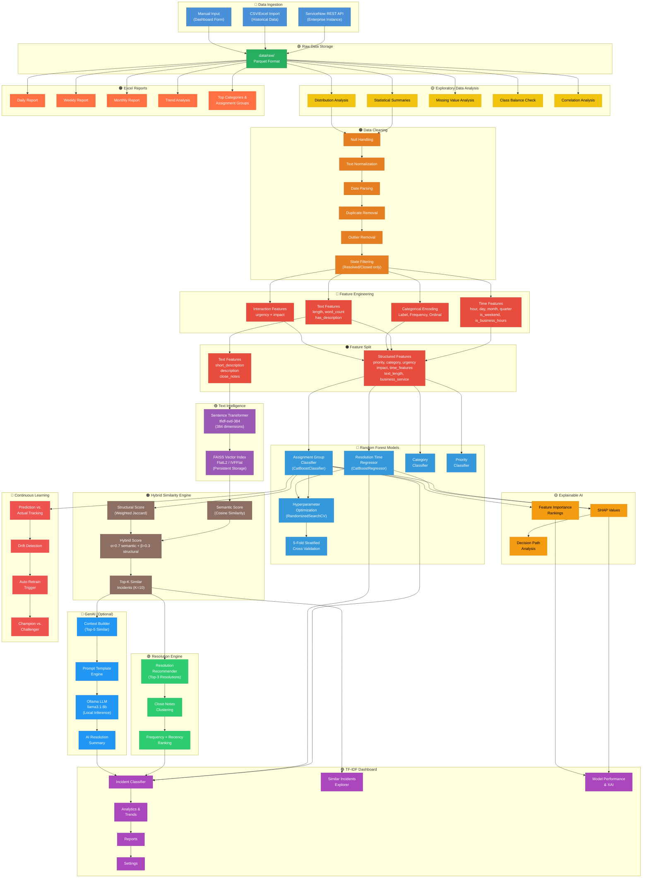
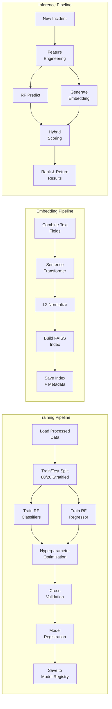

# Pipeline Diagram — Version 1.0
# Date: 2026-07-10
# Status: Architecture Phase (Pre-Implementation)
# Author: Principal Software Architect

## End-to-End System Pipeline

```mermaid
graph TB
    subgraph Input["🔵 Data Ingestion"]
        A1["ServiceNow REST API<br/>(Enterprise Instance)"]
        A2["CSV/Excel Import<br/>(Historical Data)"]
        A3["Manual Input<br/>(Dashboard Form)"]
    end

    subgraph Storage["🟢 Raw Data Storage"]
        B1["data/raw/<br/>Parquet Format"]
    end

    subgraph EDA["🟡 Exploratory Data Analysis"]
        C1["Statistical Summaries"]
        C2["Distribution Analysis"]
        C3["Missing Value Analysis"]
        C4["Class Balance Check"]
        C5["Correlation Analysis"]
    end

    subgraph Cleaning["🟠 Data Cleaning"]
        D1["Null Handling"]
        D2["Text Normalization"]
        D3["Date Parsing"]
        D4["Duplicate Removal"]
        D5["Outlier Removal"]
        D6["State Filtering<br/>(Resolved/Closed only)"]
    end

    subgraph FE["🔴 Feature Engineering"]
        E1["Time Features<br/>hour, day, month, quarter<br/>is_weekend, is_business_hours"]
        E2["Text Features<br/>length, word_count<br/>has_description"]
        E3["Categorical Encoding<br/>Label, Frequency, Ordinal"]
        E4["Interaction Features<br/>urgency × impact"]
    end

    subgraph Split["⚫ Feature Split"]
        F1["Structured Features<br/>priority, category, urgency<br/>impact, time_features<br/>text_length, business_service"]
        F2["Text Features<br/>short_description<br/>description<br/>close_notes"]
    end

    subgraph StructML["🔵 Random Forest Models"]
        G1["Assignment Group<br/>Classifier<br/>(CatBoostClassifier)"]
        G2["Resolution Time<br/>Regressor<br/>(CatBoostRegressor)"]
        G3["Category<br/>Classifier"]
        G4["Priority<br/>Classifier"]
        G5["Hyperparameter<br/>Optimization<br/>(RandomizedSearchCV)"]
        G6["5-Fold Stratified<br/>Cross Validation"]
    end

    subgraph TextML["🟣 Text Intelligence"]
        H1["Sentence Transformer<br/>tfidf-svd-384<br/>(384 dimensions)"]
        H2["FAISS Vector Index<br/>FlatL2 / IVFFlat<br/>(Persistent Storage)"]
    end

    subgraph Hybrid["🟤 Hybrid Similarity Engine"]
        I1["Semantic Score<br/>(Cosine Similarity)"]
        I2["Structural Score<br/>(Weighted Jaccard)"]
        I3["Hybrid Score<br/>α=0.7 semantic + β=0.3 structural"]
        I4["Top-K Similar<br/>Incidents (K=10)"]
    end

    subgraph XAI["🟡 Explainable AI"]
        J1["SHAP Values"]
        J2["Feature Importance<br/>Rankings"]
        J3["Decision Path<br/>Analysis"]
    end

    subgraph Resolution["🟢 Resolution Engine"]
        K1["Resolution<br/>Recommender<br/>(Top-3 Resolutions)"]
        K2["Close Notes<br/>Clustering"]
        K3["Frequency + Recency<br/>Ranking"]
    end

    subgraph RAG["🔵 GenAI (Optional)"]
        L1["Context Builder<br/>(Top-5 Similar)"]
        L2["Prompt Template<br/>Engine"]
        L3["Ollama LLM<br/>llama3.1:8b<br/>(Local Inference)"]
        L4["AI Resolution<br/>Summary"]
    end

    subgraph Dashboard["🟣 TF-IDF Dashboard"]
        M1["Incident Classifier"]
        M2["Similar Incidents<br/>Explorer"]
        M3["Model Performance<br/>& XAI"]
        M4["Analytics &<br/>Trends"]
        M5["Reports"]
        M6["Settings"]
    end

    subgraph Reports["🟠 Excel Reports"]
        N1["Daily Report"]
        N2["Weekly Report"]
        N3["Monthly Report"]
        N4["Trend Analysis"]
        N5["Top Categories &<br/>Assignment Groups"]
    end

    subgraph CL["🔴 Continuous Learning"]
        O1["Prediction vs.<br/>Actual Tracking"]
        O2["Drift Detection"]
        O3["Auto Retrain<br/>Trigger"]
        O4["Champion vs.<br/>Challenger"]
    end

    %% Flow connections
    A1 --> B1
    A2 --> B1
    A3 --> B1

    B1 --> C1
    B1 --> C2
    B1 --> C3
    B1 --> C4
    B1 --> C5

    C1 --> D1
    C2 --> D1
    D1 --> D2 --> D3 --> D4 --> D5 --> D6

    D6 --> E1
    D6 --> E2
    D6 --> E3
    D6 --> E4

    E1 --> F1
    E2 --> F1
    E3 --> F1
    E4 --> F1
    E2 --> F2

    F1 --> G1
    F1 --> G2
    F1 --> G3
    F1 --> G4
    G1 --> G5
    G2 --> G5
    G5 --> G6

    F2 --> H1
    H1 --> H2

    H2 --> I1
    G1 --> I2
    I1 --> I3
    I2 --> I3
    I3 --> I4

    G1 --> J1
    G2 --> J1
    G1 --> J2
    J1 --> J3

    I4 --> K1
    K1 --> K2
    K2 --> K3

    I4 --> L1
    L1 --> L2
    L2 --> L3
    L3 --> L4

    G1 --> M1
    G2 --> M1
    I4 --> M2
    J1 --> M3
    J2 --> M3

    B1 --> N1
    B1 --> N2
    B1 --> N3
    B1 --> N4
    B1 --> N5

    G1 --> O1
    O1 --> O2
    O2 --> O3
    O3 --> O4

    M1 --> M4
    M4 --> M5
    M5 --> M6

    K3 --> M1
    L4 --> M1

    %% Styling
    classDef input fill:#4A90D9,color:white,stroke:#2E6BA6
    classDef storage fill:#27AE60,color:white,stroke:#1E8449
    classDef eda fill:#F1C40F,color:black,stroke:#D4AC0D
    classDef cleaning fill:#E67E22,color:white,stroke:#CA6F1E
    classDef feature fill:#E74C3C,color:white,stroke:#CB4335
    classDef rf fill:#3498DB,color:white,stroke:#2E86C1
    classDef text fill:#9B59B6,color:white,stroke:#7D3C98
    classDef hybrid fill:#8D6E63,color:white,stroke:#6D4C41
    classDef xai fill:#F39C12,color:black,stroke:#D68910
    classDef resolution fill:#2ECC71,color:white,stroke:#27AE60
    classDef rag fill:#2196F3,color:white,stroke:#1976D2
    classDef dashboard fill:#AB47BC,color:white,stroke:#8E24AA
    classDef reports fill:#FF7043,color:white,stroke:#F4511E
    classDef cl fill:#EF5350,color:white,stroke:#E53935

    class A1,A2,A3 input
    class B1 storage
    class C1,C2,C3,C4,C5 eda
    class D1,D2,D3,D4,D5,D6 cleaning
    class E1,E2,E3,E4 feature
    class F1,F2 feature
    class G1,G2,G3,G4,G5,G6 rf
    class H1,H2 text
    class I1,I2,I3,I4 hybrid
    class J1,J2,J3 xai
    class K1,K2,K3 resolution
    class L1,L2,L3,L4 rag
    class M1,M2,M3,M4,M5,M6 dashboard
    class N1,N2,N3,N4,N5 reports
    class O1,O2,O3,O4 cl
```

## ML Pipeline Detail

```mermaid
graph LR
    subgraph Training["Training Pipeline"]
        T1["Load Processed<br/>Data"] --> T2["Train/Test Split<br/>80/20 Stratified"]
        T2 --> T3["Train RF<br/>Classifiers"]
        T2 --> T4["Train RF<br/>Regressor"]
        T3 --> T5["Hyperparameter<br/>Optimization"]
        T4 --> T5
        T5 --> T6["Cross<br/>Validation"]
        T6 --> T7["Model<br/>Registration"]
        T7 --> T8["Save to<br/>Model Registry"]
    end

    subgraph Embedding["Embedding Pipeline"]
        E1["Combine Text<br/>Fields"] --> E2["Sentence<br/>Transformer"]
        E2 --> E3["L2 Normalize"] --> E4["Build FAISS<br/>Index"]
        E4 --> E5["Save Index<br/>+ Metadata"]
    end

    subgraph Inference["Inference Pipeline"]
        I1["New Incident"] --> I2["Feature<br/>Engineering"]
        I2 --> I3["RF Predict"]
        I2 --> I4["Generate<br/>Embedding"]
        I3 --> I5["Hybrid<br/>Scoring"]
        I4 --> I5
        I5 --> I6["Rank & Return<br/>Results"]
    end
```
